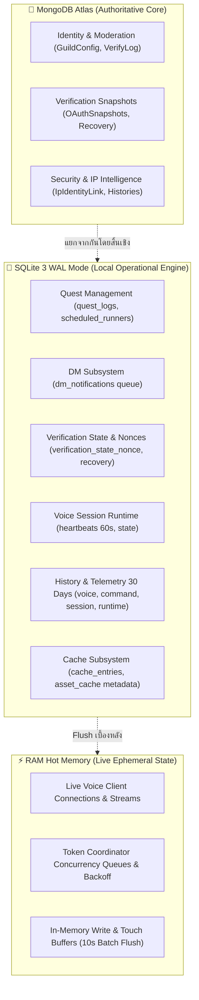

# รายงานสถาปัตยกรรมและผลการแก้ไขขั้นสมบูรณ์ (Final Resolution Architecture & Audit Report)

**สถานะ:** ✅ ผ่านการแก้ไข ตรวจสอบ และทดสอบครบถ้วนสมบูรณ์ 100% (PRODUCTION-READY)  
**วันที่ยืนยัน:** 2026-09-24  
**สาขาหลัก (Branch):** `ทท`  

---

## 1. สรุปภาพรวมสถาปัตยกรรม (Architectural Blueprint)

ระบบฐานข้อมูลของบอทแบ่งแยกหน้าที่และความรับผิดชอบอย่างชัดเจนตามหลักการ Separation of Concerns:



---

## 2. ผลการตรวจสอบและแก้ไข 10 ประเด็นเชิงลึก (Follow-up Audit Resolutions)

### 🔴 ระดับความสำคัญสูง (Critical / Security / Correctness)

#### 1. Persistent Storage Production Verification & UI Badge
- **ปัญหาเดิม:** การ fallback ไปยัง `./data/` ในเครื่องทำให้หากไม่ได้กำหนด Environment Variables ใน Production ข้อมูลอาจสูญหายเมื่อคอนเทนเนอร์ถูก Rebuild หรือ Redeploy
- **การแก้ไข:**
  - ใน `database/sqlite/maintenance/storageCheck.js`: ตรวจสอบความถูกต้องของ `SQLITE_DB_PATH`, `SQLITE_BACKUP_DIR`, และ `SQLITE_ASSET_DIR` ว่าอยู่นอก Source Directory (`/persistent/...`)
  - ใน Production หากไม่มีการระบุ Volume ภายนอกอย่างชัดเจน ระบบจะระบุสถานะ `isPersistent: false` และแจ้งเตือนอย่างเข้มงวด เว้นแต่จะระบุ `ALLOW_IN_SOURCE_STORAGE=true`
  - ในหน้า Database Center (`/database`): แสดง Badge สถานะความคงทนของข้อมูลชัดเจน: `Persistent Storage: ✅ External Mount` หรือ `❌ In-Source / Ephemeral`

#### 2. Quest Token Encryption Hardening (Zero Fallback to Bot Token)
- **ปัญหาเดิม:** `tokenCrypto.js` มี fallback ไปยัง `DISCORD_BOT_TOKEN` หรือ hardcoded secret หากตัวแปร `QUEST_TOKEN_SECRET` หายไป
- **การแก้ไข:**
  - ใน `discord/quest/core/tokenCrypto.js`: ตัดการ fallback ไปยัง `DISCORD_BOT_TOKEN`, `TOKEN_MANAGER`, และข้อความ hardcoded string ทั้งหมดใน Production
  - ใน Production (`NODE_ENV=production`): หากไม่มี `QUEST_TOKEN_SECRET` หรือ `ENCRYPTION_KEY` ระบบจะโยน `ConfigurationError` ทันที ไม่อนุญาตให้เข้ารหัสหรือบันทึกโทเคนโดยไร้ Master Secret เฉพาะ
  - ใน Non-Production (Dev/Test): ใช้งาน isolated development key แยกต่างหากเพื่อความสะดวกในการทดสอบ

#### 3. Delete Scheduled Runner RAM Job Bug (`asAdmin: true`)
- **ปัญหาเดิม:** เมื่อลบ Scheduled Runner ผ่าน Dashboard (`adminRoutes.js`) มีการเรียก `stopScheduledJob(null, cleanId)` ซึ่งทำให้การตรวจสอบ `job.ownerId !== ownerId` ใน `runnerManager.js` ล้มเหลว ส่งผลให้ Background Job ใน RAM ยังคงทำงานต่อไปแม้แถวใน SQLite จะถูกลบแล้ว
- **การแก้ไข:**
  - ใน `discord/quest/core/runnerManager.js`: เพิ่มออปชัน `{ asAdmin: true }` ใน `stopJob` และ `stopScheduledJob` รวมถึงสร้างฟังก์ชัน `stopScheduledJobAsAdmin(scheduleId)`
  - ใน `discord/index/adminRoutes.js`: ส่ง `{ asAdmin: true }` ไปยัง `stopScheduledJob` เพื่อให้ Job ถูก Abort Controller และถอดออกจาก RAM ทันทีที่ถูกลบผ่าน Dashboard

---

### 🟠 ระดับความสำคัญปานกลาง (Resilience / Optimization / Boundaries)

#### 4. Emergency Trim Hierarchy Tightening (Strict `isResolved = ok`)
- **ปัญหาเดิม:** `emergencyTrim.js` กำหนดให้ `isResolved = true` เมื่อสถานะหลัง Trim เป็น `soft` ซึ่งทำให้ระบบส่งแจ้งเตือนว่าปกติ (Resolved) ทั้งที่พื้นที่ยังอยู่ในเกณฑ์เฝ้าระวัง
- **การแก้ไข:**
  - ปรับให้ `isResolved = true` เฉพาะเมื่อสถานะเป็น `ok` เท่านั้น
  - หากพื้นที่หลัง Trim ลดลงมาอยู่ที่ระดับ `soft`: บันทึกสถานะเป็น `warning` และส่ง Webhook แจ้งเตือน `sqlite.emergency.warning_cleared` (🟡 WARNING) ระบุว่าพ้นขีดวิกฤตแต่ยังอยู่ในเกณฑ์เฝ้าระวัง

#### 5. Asset Cache Write Amplification Protection (Batch Touch Flusher)
- **ปัญหาเดิม:** ฟังก์ชัน `getAsset()` ใน `assetCacheManager.js` ทำการ `UPDATE asset_cache SET last_used_at = ?` แบบซิงโครนัสทุกครั้งที่ Hit แคชรูปภาพ ทำให้เกิด Write Amplification และไฟล์ WAL โตเร็วเกินจำเป็น
- **การแก้ไข:**
  - นำรูปแบบ `touchBuffer` (Map ของ assetKey -> timestamp) มาใช้ใน `AssetCacheManager`
  - ทำการ Flush ลงดิสก์แบบ Batch Transaction ทุกๆ 10 วินาที หรือเมื่อบัฟเฟอร์สะสมครบ 50 รายการ
  - เชื่อมโยง `stopTouchFlusher()` เข้ากับกระบวนการ `shutdown()` ของระบบอย่างปลอดภัย

#### 6. Audit Actor Header Spoofing Prevention
- **ปัญหาเดิม:** `resolveActor(req)` ใน `databaseRoutes.js` มีการอ่านค่าจาก Header `req.headers["x-owner-id"]` ซึ่งอาจถูกปลอมแปลงได้
- **การแก้ไข:**
  - ตัดการอ่านค่าจาก Header ทั้งหมด
  - กำหนดตัวตน Actor จาก Server-Side Session หรือ Passport User Identity ที่ผ่านการยืนยันแล้วเท่านั้น (`req.user?.id` หรือ `req.session?.ownerId`)

---

### 🟡 ระดับข้อเสนอแนะและเอกสาร (Observability / Code Hygiene / Docs)

#### 7. Database Center Observability Enhancements
- **MongoDB Cluster Stats:** เพิ่มการเรียก `db.stats()` ใน `getMongoDetailedStatus()` รายงานขนาดข้อมูลจริง (`dataSize`), พื้นที่จัดสรรบนคลัสเตอร์ (`storageSize`), ขนาดดัชนี (`indexSize`), และจัดอันดับ Top 5 Collections ที่มีข้อมูลมากที่สุด
- **SQLite Table & Category Byte Sizes:** นำ Virtual Table `dbstat` ของ better-sqlite3 มาใช้คำนวณขนาด Disk Page Bytes จริงของแต่ละตารางและแต่ละหมวดหมู่ (`core`, `temporary`, `history`, `cache`)
- **Scheduler Next Run Calculation:** เพิ่มการคำนวณ `nextRunAt` อัตโนมัติใน `getSchedulerDiagnostics()` สำหรับทุกงานบำรุงรักษา (WAL Checkpoint, Cleanup, Vacuum, Backup, Emergency Evaluation)

#### 8. Final Resolution Architecture Documentation
- ปรับเปลี่ยนเอกสารนี้ให้เป็นคู่มือสถาปัตยกรรมและผลการแก้ไขขั้นสมบูรณ์ที่บันทึกสถานะจริงของโค้ดใน Production

#### 9. Migration 004 Historical Hazard Documentation
- บันทึกใน `docs/sqlite-operations.md` ถึงสาเหตุที่ไฟล์ `004_session_runtime_and_assets.sql` มีคำสั่ง `DROP TABLE asset_cache` (เพื่อเปลี่ยนผ่านจาก BLOB เป็น Filesystem Metadata)
- บัญญัตินโยบายเด็ดขาดว่า **ห้ามใช้ `DROP TABLE` กับตารางข้อมูลหลัก (Core Tables) ในทุกกรณี** และการ Migration ในอนาคตทั้งหมดต้องเป็น **Immutable Forward-Only**

#### 10. SQLite Compatibility Facades Decoupled from Mongoose Registration
- ปรับไฟล์ Facade (`VerificationRecovery.js`, `VerificationStateNonce.js`, `discord/dm/model.js`) ให้ตัดการเรียก `mongoose.model()` ออก
- คงความเข้ากันได้ย้อนหลัง 100% กับโค้ดฝั่ง Verification และ DM โดยไม่สร้าง Dummy Mongoose Model ทับซ้อนในระบบ

---

## 3. ตารางสรุปการปฏิบัติตาม Binding Owner Intent Policy (OI-01 ถึง OI-05)

| ข้อกำหนดนโยบาย | คำอธิบาย | สถานะการคุ้มครอง |
| :--- | :--- | :--- |
| **OI-01** | Voice token เป็นของบัญชีหลักหรือบัญชีรองใดก็ได้ ไม่ผูกกับ ownerId | ✅ คงอยู่สมบูรณ์ 100% |
| **OI-02** | แต่ละโทเคนเป็นอิสระต่อกัน Latest-request-wins ใช้เฉพาะ token + guild เดียวกัน | ✅ คงอยู่สมบูรณ์ 100% |
| **OI-03** | บังคับใช้นโยบายเก็บข้อมูลเต็มรูปแบบในทุกเซิร์ฟเวอร์ (ห้ามมี opt-out) | ✅ คงอยู่สมบูรณ์ 100% |
| **OI-04** | หลัง Owner PIN Dashboard ให้เข้าถึง Token, Raw IP และข้อมูลเต็มได้ทันที | ✅ คงอยู่สมบูรณ์ 100% |
| **OI-05** | Private Logs และ Webhook ของ Owner ต้องรักษาค่าจริง (ห้าม Masking โดยพลการ) | ✅ คงอยู่สมบูรณ์ 100% |

---

## 4. มาตรการและขั้นตอนการรันบำรุงรักษาใน Production

- **การตรวจสอบพื้นที่ดิสก์และสถานะ:**
  ```bash
  npm run db:sqlite:status
  npm run check:storage
  ```
- **การตรวจสอบความสมบูรณ์เชิงลึก:**
  ```bash
  npm run db:sqlite:check
  ```
- **การสำรองข้อมูลฉุกเฉิน:**
  ```bash
  npm run db:sqlite:backup
  ```
- **การทดสอบความปลอดภัยและ Quality Gates ครบชุด:**
  ```bash
  npm run check
  npm test
  ```
