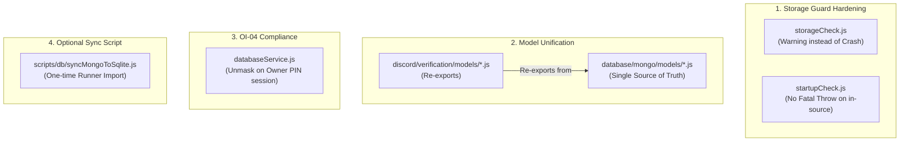

# แผนการดำเนินการแก้ไขและปรับปรุงสถาปัตยกรรม (Post-Audit Resolution Plan)

**ไฟล์อ้างอิงการตรวจสอบ:** [`docs/POST_IMPLEMENTATION_AUDIT.md`](file:///workspaces/discordbot3/docs/POST_IMPLEMENTATION_AUDIT.md)  
**สถานะ:** รอความเห็นชอบและยืนยันทางเลือกจาก Owner (Pending Review)

---

## 1. วัตถุประสงค์ (Goal Description)

แก้ไขและปรับปรุงประเด็นที่พบจากการทำ **Post-Implementation Architecture Audit** โดยจัดลำดับความสำคัญและเสนอทางเลือกเชิงปฏิบัติการที่ปลอดภัยที่สุด:
1. **แก้ปัญหาความเสี่ยงการบูตใน Production (เกรด D):** ปรับแก้ `storageCheck.js` และ `startupCheck.js` ไม่ให้เกิด Fatal Crash เมื่อรันบน Dedicated Discord Bot Hosting (Pterodactyl, VPS, หรือ Docker Node Container)
2. **ขจัดความซ้ำซ้อนของ Mongoose Models (เกรด C):** ปรับให้ `discord/verification/models/*.js` ทำหน้าที่ Re-export จาก `database/mongo/models/` เพื่อรักษา Single Source of Truth
3. **ปรับแก้ Data Masking ให้สอดคล้องกับ Binding Owner Intent Policy OI-04 (เกรด C):** ปลดการ Masking IP/Token บนหน้า Database Center Dashboard หลังจาก Owner ล็อกอินด้วย PIN แล้ว
4. **ยืนยันนโยบาย Voice 429 Isolation (เกรด C):** บันทึกเป็นนโยบายอย่างเป็นทางการว่า REST 429 จะไม่ตัดห้องเสียงของผู้ใช้
5. **สคริปต์ One-time Sync สำหรับ Scheduled Runners (เกรด C):** สร้างสคริปต์เสริมสำหรับดึงข้อมูลเควสต์เก่าจาก MongoDB เข้า SQLite (ถ้ามี)

---

## 2. สิ่งที่ต้องให้ Owner พิจารณาตัดสินใจ (User Review Required)

> [!CAUTION]
> ### ประเด็นเกรด D: ปลดการ Crash บูตของ Storage Guard ใน Production
> **สภาพปัญหาปัจจุบัน:** ใน `storageCheck.js` หากรันด้วย `NODE_ENV=production` แล้วไม่ได้ตั้งค่า volume ภายนอก (`SQLITE_DB_PATH` อยู่ใน source) หรือพื้นที่ว่างต่ำกว่า 1GB ระบบจะ throw fatal error ทำให้บอท **ไม่สามารถสตาร์ทได้บนโฮสติ้ง Pterodactyl/VPS**  
> **ทางเลือกที่เสนอ:**  
> - **Option 1 (แนะนำ):** ปรับให้เป็น `Warning` แจ้งเตือนใน Console/Webhook เท่านั้น โดยไม่บล็อกการบูต และลดเกณฑ์พื้นที่ว่างวิกฤตเหลือ 100MB  
> - **Option 2:** กำหนดให้ `ALLOW_IN_SOURCE_STORAGE=true` เป็นค่าเริ่มต้น

> [!IMPORTANT]
> ### ประเด็นเกรด C: การแสดงผลข้อมูลใน Database Center ตามนโยบาย OI-04
> **สภาพปัญหาปัจจุบัน:** ฟังก์ชัน `maskSensitiveValue` ซ่อน IP เป็น `192.168.***.***` และซ่อน Token เป็น `[PROTECTED_SECRET]` ในหน้า Database Center ซึ่งขัดกับ `docs/OWNER_INTENT_POLICY.md` (OI-04) ที่ระบุว่าหลังใส่ Owner PIN ต้องดูข้อมูลดิบได้ทันที  
> **ทางเลือกที่เสนอ:**  
> - **Option 1 (แนะนำ):** ปลด Masking ออก ให้ Owner เห็นข้อมูลจริงตามนโยบาย OI-04  
> - **Option 2:** คง Masking ไว้และเพิ่มปุ่ม Toggle "แสดงข้อมูลดิบ (Reveal Raw Data)" บนหน้าเว็บ  
> - **Option 3:** คง Masking ไว้ตามเดิม

> [!NOTE]
> ### ประเด็นเกรด C: Voice 429 Isolation & Mongoose Model Unification
> - **Voice 429:** แนะนำให้ **คงไว้ตามปัจจุบัน** (Voice ไม่หลุดเมื่อ Task เบื้องหลังโดน 429)
> - **Model Unification:** แนะนำให้ `discord/verification/models/*.js` ทำการ **re-export** จาก `database/mongo/models/` เพื่อไม่ให้มีไฟล์ Schema ซ้ำ 2 แห่ง

---

## 3. รายละเอียดไฟล์และการแก้ไข (Proposed Code Changes)



---

### Component 1: Production Storage Guard Hardening (`database/sqlite/maintenance/`)

#### [MODIFY] `database/sqlite/maintenance/storageCheck.js`
- ปรับเปลี่ยนเมื่อ `isProduction && !allowInSource`: บันทึกเป็น `warnings.push` แทน `errors.push` เว้นแต่จะระบุ `options.allowInSource === false` ใน Test
- ปรับเกณฑ์พื้นที่ว่าง:
  - `< 100MB`: บันทึกเป็น `error` (วิกฤตจริง)
  - `100MB - 1,000MB`: บันทึกเป็น `warning` (แจ้งเตือนแต่ยอมให้ทำงาน)

#### [MODIFY] `database/sqlite/maintenance/startupCheck.js`
- ปรับปรุง Error handling ในส่วน pre-flight check ไม่ให้ throw fatal error เมื่อโฟลเดอร์อยู่ใน source tree

---

### Component 2: Binding Owner Intent Policy Compliance (`database/services/`)

#### [MODIFY] `database/services/databaseService.js`
- ปรับฟังก์ชัน `maskSensitiveValue` หรือเพิ่มตัวเลือก `raw: true` สำหรับ API endpoint `/api/db/mongo/sample/:collection` เพื่อให้ Owner ดูข้อมูลจริงที่แท้จริงได้ตามนโยบาย OI-04

---

### Component 3: Single Source of Truth for Mongoose Models (`discord/verification/models/`)

#### [MODIFY] `discord/verification/models/*.js` (ทั้ง 17 โมเดล)
- ปรับไฟล์ใน `discord/verification/models/*.js` ให้ re-export โมเดลจาก `database/mongo/models/`
- ตัวอย่างเช่น:
  ```javascript
  // discord/verification/models/GuildConfig.js
  "use strict";
  module.exports = require("../../../database/mongo/models/verification/GuildConfig");
  ```
- รับประกันความเข้ากันได้ย้อนหลัง 100% กับทุกโมดูลในระบบ Verification

---

### Component 4: Optional Scheduled Runner Sync (`scripts/db/`)

#### [NEW] `scripts/db/syncMongoToSqlite.js`
- สคริปต์ standalone สำหรับดึงเอกสาร `ScheduledRunner` จาก MongoDB Atlas มาแปลงลงตาราง `scheduled_runners` ใน SQLite
- ทำงานแบบ Idempotent (`INSERT OR IGNORE`) ไม่เขียนทับข้อมูลที่มีอยู่แล้ว

---

## 4. แผนการทดสอบและตรวจสอบความถูกต้อง (Verification Plan)

### Automated Tests
1. **ทดสอบ Storage Check ทั้งใน Dev และ Production Mode:**
   ```bash
   node --test test/database/storageCheck.test.js
   ```
2. **ทดสอบ SQLite Startup & Invariants:**
   ```bash
   node --test test/database/sqliteStartup.test.js
   ```
3. **ทดสอบ Database Service & Webhooks Lifecycle:**
   ```bash
   npm run test:database
   ```
4. **ทดสอบ Quality Gates ครบทั้ง 10 ขั้นตอน:**
   ```bash
   npm run check
   ```
5. **ทดสอบ Regression ครบทุกชุดของบอท (Discord, Voice, Verification, Database):**
   ```bash
   npm test
   ```

### Manual Verification
- รันสคริปต์ทดสอบสภาวะจำลอง Production:
  ```bash
  NODE_ENV=production node scripts/db/checkStorage.js
  ```
  ยืนยันว่าแสดงข้อความ Warning แจ้งเตือนอย่างถูกต้อง และ Exit code เป็น 0
