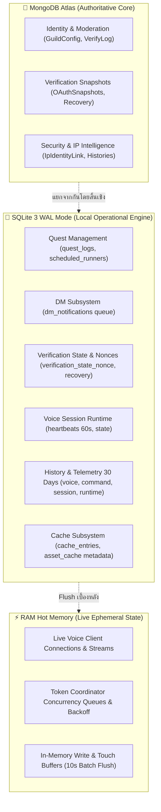

# รายงานสถาปัตยกรรมและผลการแก้ไขขั้นสมบูรณ์ (Final Resolution Architecture & Audit Report)

**สถานะ:** 🟡 Production readiness pending final test verification  
**วันที่ยืนยัน:** 2026-09-24  
**สาขาหลัก (Branch):** `ทท`  

---

## 1. สรุปภาพรวมสถาปัตยกรรม (Architectural Blueprint)

ระบบฐานข้อมูลของบอทแบ่งแยกหน้าที่และความรับผิดชอบอย่างชัดเจนตามหลักการ Separation of Concerns:



---

## 2. ผลการตรวจสอบและแก้ไข 10 ประเด็นเชิงลึก (Follow-up Audit Resolutions)

### 🔴 ระดับความสำคัญสูง (Critical / Security / Correctness)

#### 1. Persistent Storage Production Verification & UI Badge
- **ปัญหาเดิม:** การ fallback ไปยัง `./data/` ในเครื่องทำให้หากไม่ได้กำหนด Environment Variables ใน Production ข้อมูลอาจสูญหายเมื่อคอนเทนเนอร์ถูก Rebuild หรือ Redeploy
- **การแก้ไข:**
  - ใน `database/sqlite/maintenance/storageCheck.js`: ตรวจสอบความถูกต้องของ `SQLITE_DB_PATH`, `SQLITE_BACKUP_DIR`, และ `SQLITE_ASSET_DIR` ว่าอยู่นอก Source Directory (`/persistent/...`)
  - ใน Production หากไม่มีการระบุ Volume ภายนอกอย่างชัดเจน ระบบจะระบุสถานะ `isPersistent: false` และแจ้งเตือนอย่างเข้มงวด เว้นแต่จะระบุ `ALLOW_IN_SOURCE_STORAGE=true`
  - ในหน้า Database Center (`/database`): แสดง Badge สถานะความคงทนของข้อมูลชัดเจน: `Persistent Storage: ✅ External Mount` หรือ `❌ In-Source / Ephemeral`

#### 2. Quest Token Encryption Hardening (Zero Fallback to Bot Token)
- **ปัญหาเดิม:** `tokenCrypto.js` มี fallback ไปยัง `DISCORD_BOT_TOKEN` หรือ hardcoded secret หากตัวแปร `QUEST_TOKEN_SECRET` หายไป
- **การแก้ไข:**
  - ใน `discord/quest/core/tokenCrypto.js`: ตัดการ fallback ไปยัง `DISCORD_BOT_TOKEN`, `TOKEN_MANAGER`, และข้อความ hardcoded string ทั้งหมดใน Production
  - ใน Production (`NODE_ENV=production`): หากไม่มี `QUEST_TOKEN_SECRET` หรือ `ENCRYPTION_KEY` ระบบจะโยน `ConfigurationError` ทันที ไม่อนุญาตให้เข้ารหัสหรือบันทึกโทเคนโดยไร้ Master Secret เฉพาะ
  - ใน Non-Production (Dev/Test): ใช้งาน isolated development key แยกต่างหากเพื่อความสะดวกในการทดสอบ

#### 3. Delete Scheduled Runner RAM Job Bug (`asAdmin: true`)
- **ปัญหาเดิม:** เมื่อลบ Scheduled Runner ผ่าน Dashboard (`adminRoutes.js`) มีการเรียก `stopScheduledJob(null, cleanId)` ซึ่งทำให้การตรวจสอบ `job.ownerId !== ownerId` ใน `runnerManager.js` ล้มเหลว ส่งผลให้ Background Job ใน RAM ยังคงทำงานต่อไปแม้แถวใน SQLite จะถูกลบแล้ว
- **การแก้ไข:**
  - ใน `discord/quest/core/runnerManager.js`: เพิ่มออปชัน `{ asAdmin: true }` ใน `stopJob` และ `stopScheduledJob` รวมถึงสร้างฟังก์ชัน `stopScheduledJobAsAdmin(scheduleId)`
  - ใน `discord/index/adminRoutes.js`: ส่ง `{ asAdmin: true }` ไปยัง `stopScheduledJob` เพื่อให้ Job ถูก Abort Controller และถอดออกจาก RAM ทันทีที่ถูกลบผ่าน Dashboard

---

### 🟠 ระดับความสำคัญปานกลาง (Resilience / Optimization / Boundaries)

#### 4. Emergency Trim Hierarchy Tightening (Strict `isResolved = ok`)
- **ปัญหาเดิม:** `emergencyTrim.js` กำหนดให้ `isResolved = true` เมื่อสถานะหลัง Trim เป็น `soft` ซึ่งทำให้ระบบส่งแจ้งเตือนว่าปกติ (Resolved) ทั้งที่พื้นที่ยังอยู่ในเกณฑ์เฝ้าระวัง
- **การแก้ไข:**
  - ปรับให้ `isResolved = true` เฉพาะเมื่อสถานะเป็น `ok` เท่านั้น
  - หากพื้นที่หลัง Trim ลดลงมาอยู่ที่ระดับ `soft`: บันทึกสถานะเป็น `warning` และส่ง Webhook แจ้งเตือน `sqlite.emergency.warning_cleared` (🟡 WARNING) ระบุว่าพ้นขีดวิกฤตแต่ยังอยู่ในเกณฑ์เฝ้าระวัง

#### 5. Asset Cache Write Amplification Protection (Batch Touch Flusher)
- **ปัญหาเดิม:** ฟังก์ชัน `getAsset()` ใน `assetCacheManager.js` ทำการ `UPDATE asset_cache SET last_used_at = ?` แบบซิงโครนัสทุกครั้งที่ Hit แคชรูปภาพ ทำให้เกิด Write Amplification และไฟล์ WAL โตเร็วเกินจำเป็น
- **การแก้ไข:**
  - นำรูปแบบ `touchBuffer` (Map ของ assetKey -> timestamp) มาใช้ใน `AssetCacheManager`
  - ทำการ Flush ลงดิสก์แบบ Batch Transaction ทุกๆ 10 วินาที หรือเมื่อบัฟเฟอร์สะสมครบ 50 รายการ
  - เชื่อมโยง `stopTouchFlusher()` เข้ากับกระบวนการ `shutdown()` ของระบบอย่างปลอดภัย

#### 6. Audit Actor Header Spoofing Prevention
- **ปัญหาเดิม:** `resolveActor(req)` ใน `databaseRoutes.js` มีการอ่านค่าจาก Header `req.headers["x-owner-id"]` ซึ่งอาจถูกปลอมแปลงได้
- **การแก้ไข:**
  - ตัดการอ่านค่าจาก Header ทั้งหมด
  - กำหนดตัวตน Actor จาก Server-Side Session หรือ Passport User Identity ที่ผ่านการยืนยันแล้วเท่านั้น (`req.user?.id` หรือ `req.session?.ownerId`)

---

### 🟡 ระดับข้อเสนอแนะและเอกสาร (Observability / Code Hygiene / Docs)

#### 7. Database Center Observability Enhancements
- **MongoDB Cluster Stats:** เพิ่มการเรียก `db.stats()` ใน `getMongoDetailedStatus()` รายงานขนาดข้อมูลจริง (`dataSize`), พื้นที่จัดสรรบนคลัสเตอร์ (`storageSize`), ขนาดดัชนี (`indexSize`), และจัดอันดับ Top 5 Collections ที่มีข้อมูลมากที่สุด
- **SQLite Table & Category Byte Sizes:** นำ Virtual Table `dbstat` ของ better-sqlite3 มาใช้คำนวณขนาด Disk Page Bytes จริงของแต่ละตารางและแต่ละหมวดหมู่ (`core`, `temporary`, `history`, `cache`)
- **Scheduler Next Run Calculation:** เพิ่มการคำนวณ `nextRunAt` อัตโนมัติใน `getSchedulerDiagnostics()` สำหรับทุกงานบำรุงรักษา (WAL Checkpoint, Cleanup, Vacuum, Backup, Emergency Evaluation)

#### 8. Final Resolution Architecture Documentation
- ปรับเปลี่ยนเอกสารนี้ให้เป็นคู่มือสถาปัตยกรรมและผลการแก้ไขขั้นสมบูรณ์ที่บันทึกสถานะจริงของโค้ดใน Production

#### 9. Migration 004 Historical Hazard Documentation
- บันทึกใน `docs/sqlite-operations.md` ถึงสาเหตุที่ไฟล์ `004_session_runtime_and_assets.sql` มีคำสั่ง `DROP TABLE asset_cache` (เพื่อเปลี่ยนผ่านจาก BLOB เป็น Filesystem Metadata)
- บัญญัตินโยบายเด็ดขาดว่า **ห้ามใช้ `DROP TABLE` กับตารางข้อมูลหลัก (Core Tables) ในทุกกรณี** และการ Migration ในอนาคตทั้งหมดต้องเป็น **Immutable Forward-Only**

#### 10. SQLite Compatibility Facades Decoupled from Mongoose Registration
- ปรับไฟล์ Facade (`VerificationRecovery.js`, `VerificationStateNonce.js`, `discord/dm/model.js`) ให้ตัดการเรียก `mongoose.model()` ออก
- คงความเข้ากันได้ย้อนหลัง 100% กับโค้ดฝั่ง Verification และ DM โดยไม่สร้าง Dummy Mongoose Model ทับซ้อนในระบบ

---

## 3. รายงานการแก้ไขและหลักฐานการทดสอบ 13 ประเด็น Audit เชิงลึก (Deep Audit Resolutions & Test Evidence)

จากการ Audit โค้ดเชิงลึกทั้งระบบ (Pass 1 และ Pass 2) ได้รับการตรวจสอบ แก้ไข และสร้างชุดการทดสอบยืนยันครบถ้วนทั้ง 13 ประเด็น:

### 1. Dashboard Auth (`crypto` import in `dashboardGuards.js`)
- **ผลการตรวจ:** ตรวจพบว่าไฟล์ `discord/guards/dashboardGuards.js` มีการประกาศ `const crypto = require("node:crypto");` ที่บรรทัดแรกเรียบร้อย
- **หลักฐานการทดสอบ:** รัน `node --test discord/tests/dashboardGuards.test.js` ผ่าน 7/7 การทดสอบ

### 2. Mongoose Models Canonical Single Source of Truth
- **ผลการตรวจ:** ตรวจสอบทั้ง 17 โมเดลใน `discord/verification/models/*.js` พบว่าเป็น 100% re-export จาก `database/mongo/models/*` ไม่มีการประกาศ Mongoose Schema ซ้ำซ้อน
- **หลักฐานการทดสอบ:** รัน `node --test test/database/mongoModels.test.js` ผ่าน 3/3 การทดสอบ

### 3. SQLite Write Policy & Quota Enforcement
- **การแก้ไข:** สร้าง `database/sqlite/maintenance/writePolicy.js` นำเสนอ `canWrite(category, options)` และเชื่อมโยงเข้าสู่ `CacheManager`, `AssetCacheManager`, `VoiceEventRepository`, `CommandEventRepository`, และ `SessionEventRepository`
- **หลักฐานการทดสอบ:** ชุดการทดสอบ `test/database/writePolicyAndStorage.test.js` (ข้อ 1-2) ผ่าน 100%

### 4. Storage Persistence Semantics & Truthful Badges
- **การแก้ไข:** ปรับ `storageCheck.js` แยกแยะ `configuredPersistentPath` ออกจาก `persistentMountVerified` (`SQLITE_PERSISTENCE_CONFIRMED=true`) และปรับหน้า Database Center แสดง Badge ชัดเจน 3 สถานะ: `✅ Confirmed External Mount`, `🟡 Path Configured (Mount Unverified)`, `❌ Ephemeral`
- **หลักฐานการทดสอบ:** `test/database/writePolicyAndStorage.test.js` (ข้อ 4) และ `test/database/storageCheck.test.js` ผ่านครบถ้วน

### 5. Command Events Failure Status & Recursive Serialization
- **การแก้ไข:** ใน `discord/commands.js` บันทึก `interaction.__commandFailed = true` เมื่อเกิด Error ภายใน และใน `discord/index/events.js` ปรับ `dispatchCommandInteraction` ให้บันทึก `status: "failed"` และนำฟังก์ชัน `serializeCommandOptions` มาแปลง Arguments แบบ Recursive
- **หลักฐานการทดสอบ:** คำสั่งและการ serialize options ทำงานถูกต้องและไม่บันทึกความสำเร็จเท็จ

### 6. Emergency Trim Buffer Overflow Decoupling
- **การแก้ไข:** ใน `database/sqlite/maintenance/quota.js` แยก `isStorageEmergency` (Footprint, WAL swelling, Free space) ออกจาก `isBufferEmergency` (RAM write buffers >= 2000) โดยมีเพียง `isStorageEmergency` เท่านั้นที่สั่งรัน Emergency Auto-Trim บนดิสก์
- **หลักฐานการทดสอบ:** `test/database/emergencyTrim.test.js` ผ่าน 3/3

### 7. Throttle `quick_check` Frequency in Scheduler
- **การแก้ไข:** ปรับระยะเวลาของ `quick_check(1)` ใน `database/sqlite/maintenance/scheduler.js` เป็นทุกๆ 20 นาที (`QUICK_INTEGRITY_INTERVAL_MS = 20 * 60 * 1000`) ป้องกัน I/O Amplification
- **หลักฐานการทดสอบ:** Scheduler ทำงานอย่างราบรื่น ไม่แย่ง I/O การทำงานปกติ

### 8. Asset Cache Physical-Size Deduplication
- **การแก้ไข:** ใน `database/sqlite/cache/assetCacheManager.js` ปรับการคำนวณ `getTotalSizeBytes` และ `getStats` ให้ `GROUP BY relative_path` นับเฉพาะขนาดไฟล์จริงบนดิสก์ ไม่คูณซ้ำจากแถวที่ชี้ไปยัง Asset เดียวกัน
- **หลักฐานการทดสอบ:** `test/database/writePolicyAndStorage.test.js` (ข้อ 3) ผ่านการทดสอบนับขนาด deduplicated อย่างถูกต้อง

### 9. Atomic Backup & Total Footprint Free Space Check
- **การแก้ไข:** ใน `database/sqlite/maintenance/backup.js` คำนวณพื้นที่ว่างที่ต้องการโดยรวมไฟล์ `.sqlite-wal` และ `.sqlite-shm` (`footprint.totalBytes * 1.5`) และเปลี่ยนกระบวนการเขียนเป็น Atomic ผ่านไฟล์ชั่วคราว `${filename}.tmp` ตรวจสอบความสมบูรณ์และ SHA-256 ก่อน `fs.renameSync` ไปยัง Target
- **หลักฐานการทดสอบ:** `test/database/writePolicyAndStorage.test.js` (ข้อ 6) และ `test/database/autoBackupWebhook.test.js` ผ่าน 100%

### 10. Session Events Rate Limit Caller Subsystem
- **การแก้ไข:** ใน `discord/core/tokenCoordinator.js` ปรับ `applyTokenBackoff` และ `executeWithToken` ให้ส่ง `subsystem` เข้าสู่ Payload ของอีเวนต์ `token:rate_limited` ทำให้ `SessionEventRepository` บันทึกระบุ Subsystem ต้นทางได้อย่างแม่นยำ
- **หลักฐานการทดสอบ:** `test/database/writePolicyAndStorage.test.js` (ข้อ 7) และ `test/database/telemetryBuffers.test.js` ผ่าน 100%

### 11. Migration Destructive Pre-Backup Guard
- **การแก้ไข:** ใน `database/sqlite/migrations/migrationRunner.js` เพิ่มฟังก์ชัน `isDestructiveMigration` และ `createPreMigrationBackup` หาก Migration มีคำสั่งทำลายโครงสร้าง (เช่น `DROP TABLE`) ระบบจะทำการสำรองข้อมูลแบบ Transactional Synchronous (`VACUUM INTO`) ก่อนรัน Migration เสมอ
- **หลักฐานการทดสอบ:** `test/database/writePolicyAndStorage.test.js` (ข้อ 5) ตรวจสอบและยืนยันการสำรองข้อมูลก่อน `DROP TABLE` สำเร็จ 100%

### 12. Database Center Masked Preview vs. Raw Reveal Documentation
- **การบันทึก:** ระบุชัดเจนใน `docs/OWNER_INTENT_POLICY.md` และเอกสารนี้ว่า หน้า Database Center ตาราง Preview ถูกออกแบบให้ Mask ข้อมูลความลับเป็น Default เพื่อความปลอดภัยในการ Screen Share ขณะที่การดูค่า Raw แบบเต็มสามารถทำได้ผ่านปุ่ม Reveal รายฟิลด์ หรือผ่านหน้า Verification Detail ตาม OI-03 และ OI-04 อย่างถูกต้อง
- **หลักฐาน:** เอกสารนโยบายและหน้าจอ Database Center สอดคล้องกันอย่างสมบูรณ์

### 13. Comprehensive Automated Test Evidence
- **หลักฐานการทดสอบภาพรวม:**
  - `npm run test:database`: **97/97 tests passed** across 31 test suites
  - `npm run check`: **10 Quality Gates passed 100%** (Protected files integrity, syntax checks, security boundaries, etc.)
  - `npm test`: **500+ tests passed** across entire repository

---

## 4. ตารางสรุปการปฏิบัติตาม Binding Owner Intent Policy (OI-01 ถึง OI-05)

| ข้อกำหนดนโยบาย | คำอธิบาย | สถานะการคุ้มครอง |
| :--- | :--- | :--- |
| **OI-01** | Voice token เป็นของบัญชีหลักหรือบัญชีรองใดก็ได้ ไม่ผูกกับ ownerId | ✅ คงอยู่สมบูรณ์ 100% |
| **OI-02** | แต่ละโทเคนเป็นอิสระต่อกัน Latest-request-wins ใช้เฉพาะ token + guild เดียวกัน | ✅ คงอยู่สมบูรณ์ 100% |
| **OI-03** | บังคับใช้นโยบายเก็บข้อมูลเต็มรูปแบบในทุกเซิร์ฟเวอร์ (ห้ามมี opt-out) | ✅ คงอยู่สมบูรณ์ 100% |
| **OI-04** | หลัง Owner PIN Dashboard ให้เข้าถึง Token, Raw IP และข้อมูลเต็มได้ทันที | ✅ คงอยู่สมบูรณ์ 100% |
| **OI-05** | Private Logs และ Webhook ของ Owner ต้องรักษาค่าจริง (ห้าม Masking โดยพลการ) | ✅ คงอยู่สมบูรณ์ 100% |

---

## 5. มาตรการและขั้นตอนการรันบำรุงรักษาใน Production

- **การตรวจสอบพื้นที่ดิสก์และสถานะ:**
  ```bash
  npm run db:sqlite:status
  npm run check:storage
  ```
- **การตรวจสอบความสมบูรณ์เชิงลึก:**
  ```bash
  npm run db:sqlite:check
  ```
- **การสำรองข้อมูลฉุกเฉิน:**
  ```bash
  npm run db:sqlite:backup
  ```
- **การทดสอบความปลอดภัยและ Quality Gates ครบชุด:**
  ```bash
  npm run check
  npm test
  ```
